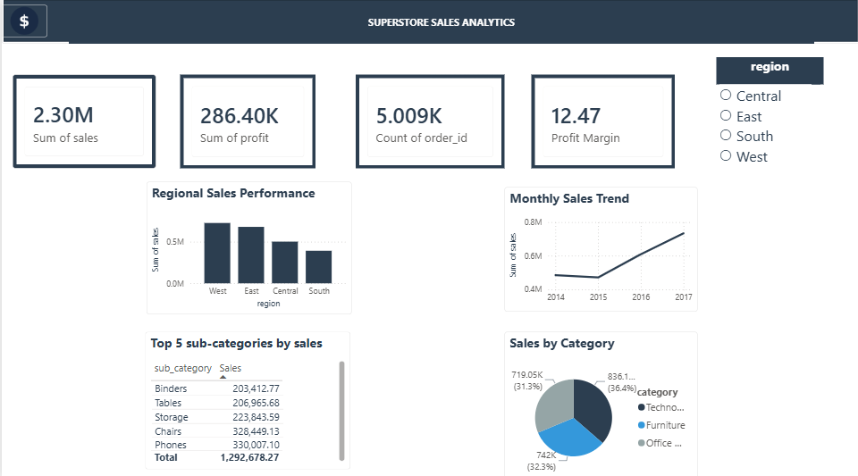

# Superstore Sales Analysis — SQL Project

A SQL-based business analysis of real-world retail sales data, exploring sales performance, profitability, customer behavior, and shipping efficiency for a global superstore.

## 📌 Overview

This project uses the **Global Superstore Sales dataset** (sourced from Kaggle) to answer real business questions using PostgreSQL — covering sales trends, regional performance, product profitability, and customer segmentation.

## 📁 Dataset

- **Source:** [Superstore Dataset - Kaggle](https://www.kaggle.com/datasets/vivek468/superstore-dataset-final)
- **Rows:** ~9,800 orders
- **Columns:** Order ID, Order Date, Ship Date, Ship Mode, Customer, Segment, Region, Category, Sub-Category, Product Name, Sales, Quantity, Discount, Profit

## 🗂️ Table Structure

| Column | Description |
|---|---|
| `order_id` | Unique order identifier |
| `order_date` / `ship_date` | Order and shipping dates |
| `ship_mode` | Shipping method used |
| `customer_name`, `segment` | Customer details and segment |
| `region`, `state`, `city` | Location of order |
| `category`, `sub_category`, `product_name` | Product details |
| `sales`, `quantity`, `discount`, `profit` | Transaction metrics |

## 🔍 What's Included

- **Data loading** — CSV imported into PostgreSQL via `\copy`, with UTF-8 encoding fix
- **19 analytical SQL queries** covering:
  - Overall business performance (total sales, profit, margin)
  - Region-wise and category-wise profitability
  - Top-performing products and customers
  - Loss-making products & discount impact analysis
  - Monthly sales trends
  - Shipping mode & delivery time analysis
  - Window functions — ranking products by category, running cumulative sales
  - **Advanced BI analysis**:
    - Year-over-year sales growth (CTE + LAG)
    - Top 3 products per sub-category (DENSE_RANK)
    - Customer segmentation by lifetime value (High/Medium/Low)
    - 3-month moving average of sales (rolling window)
    - Discount impact analysis by bucket (pricing strategy insight)
    - Customer retention — repeat vs one-time customers
    - State-wise profitability percentile ranking

## 🛠️ Tech Stack

- PostgreSQL
- pgAdmin

## ▶️ How to Run

1. Download the dataset from the [Kaggle link](https://www.kaggle.com/datasets/vivek468/superstore-dataset-final) above.
2. Create a database and run the table creation script in `superstore_analysis.sql`.
3. Import the CSV using the `\copy` command (included as a comment in the script) via psql or pgAdmin's Query Tool.
4. Run the analysis queries to explore the results.

## 📊 Key Business Questions Answered

- What is the overall profit margin of the business?
- Which regions and product categories are most profitable?
- Which products are causing losses, and why?
- How does discount level affect profitability?
- What are the monthly sales trends?
- Which customers and products drive the most revenue?

## 📊 Dashboard Preview

*Interactive Power BI dashboard showing regional sales performance, monthly trends, and category-wise breakdown.*

## 📄 License

Free to use for learning and portfolio purposes. Dataset credit: Kaggle contributors.
